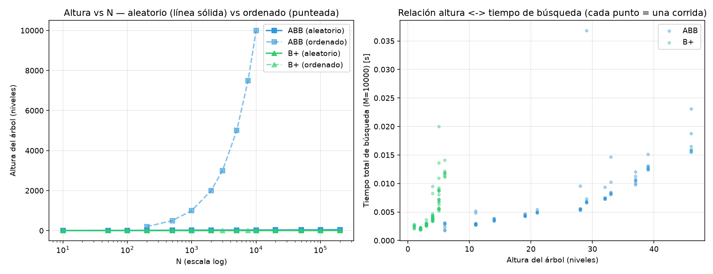
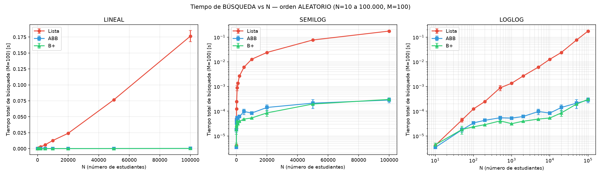
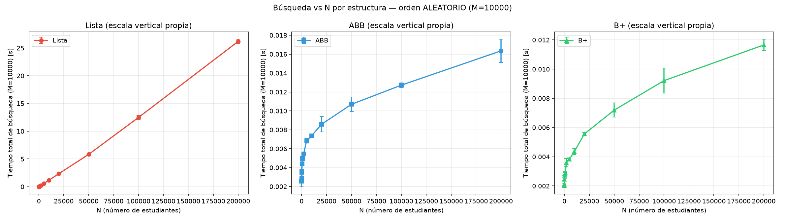
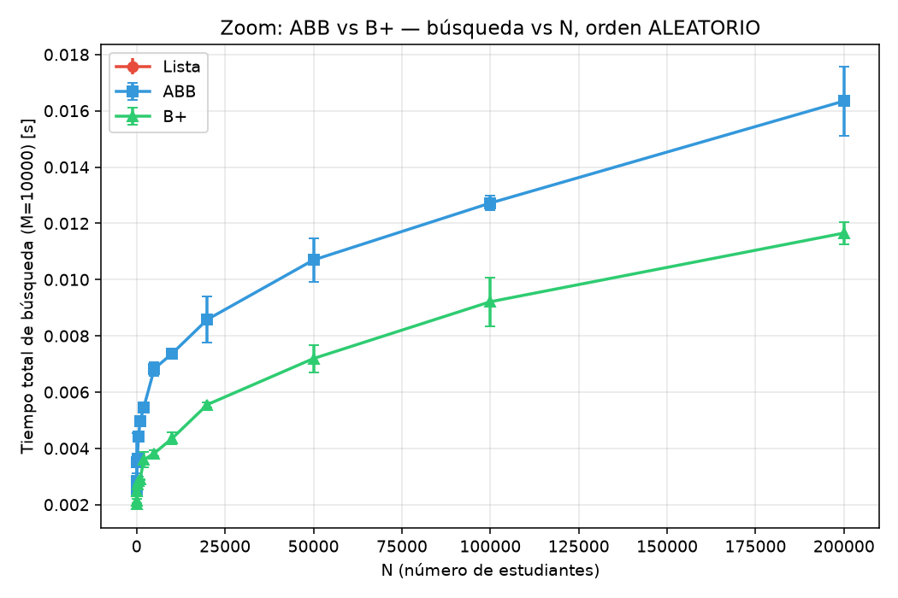
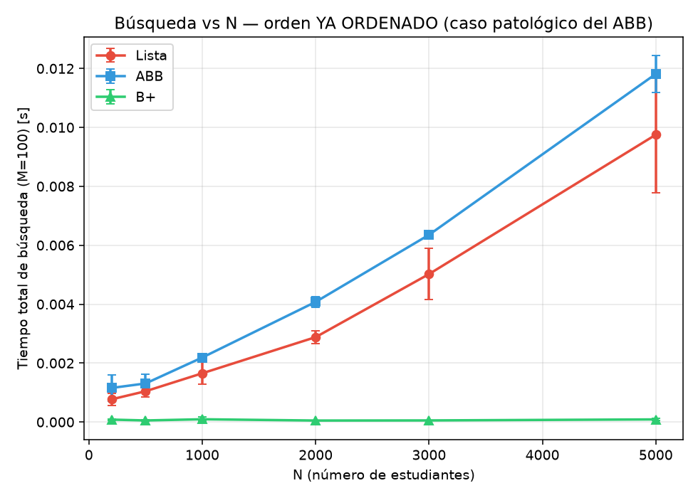
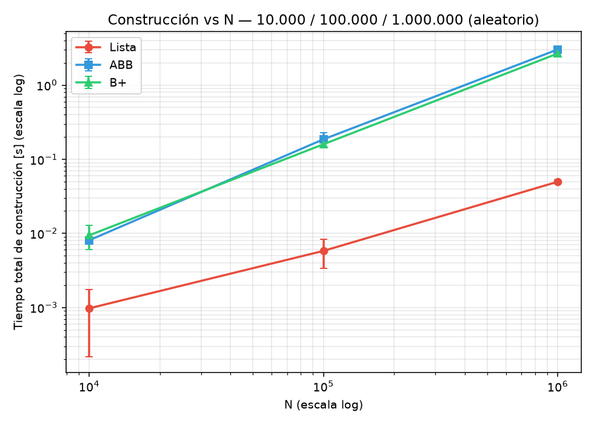
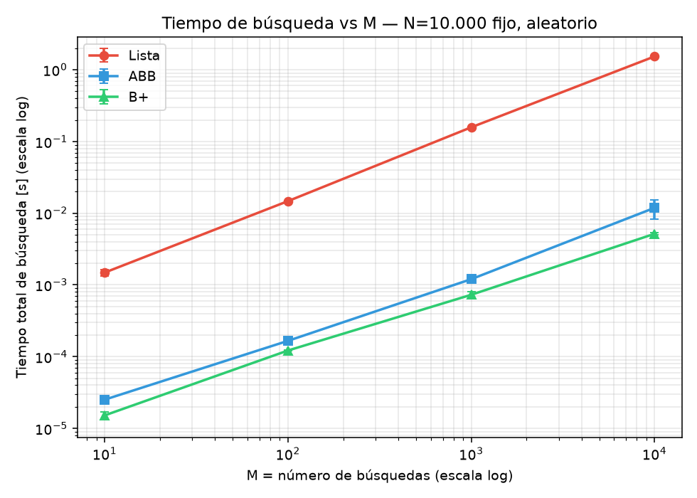
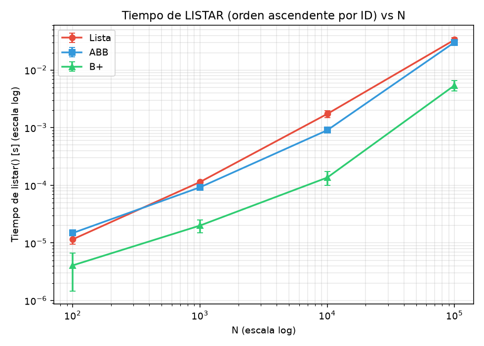
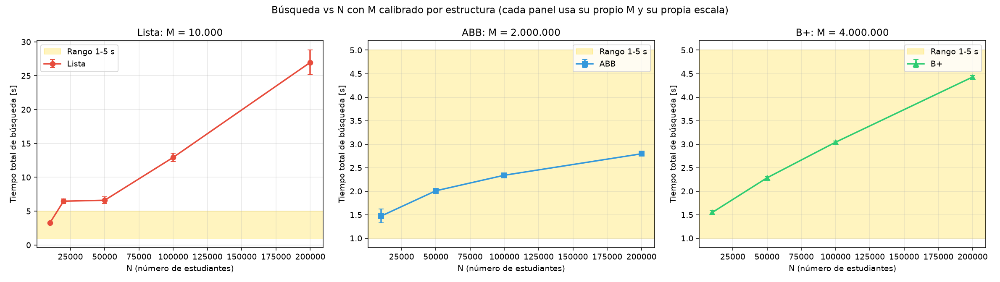

# Laboratorio 3 — Sistema de búsqueda de estudiantes
### Lista vs Árbol Binario de Búsqueda (ABB) vs Árbol B+

## Codigo de Honor/Uso de IA

Se usó un asistente de IA (Claude, Anthropic) para ayudar a diseñar la metodología estadística (tratamiento de outliers con IQR, ajuste de pendiente log-log), generar y depurar el código de los experimentos, y estructurar algo del informe. Todos los datos, cálculos y gráficas fueron ejecutados y verificados por mi en mi propia maquina.

---

## 1. Problema y objetivo

Se busca construir un sistema que permita **buscar** un estudiante por ID, **insertar** nuevos estudiantes y **listar** todos los estudiantes en orden ascendente de ID, implementado con tres estrategias de almacenamiento distintas: **Lista**, **Árbol Binario de Búsqueda (ABB)** y **Árbol B+**.

El objetivo no es solo implementar las tres estructuras, sino **estudiar experimentalmente** cómo escala el tiempo de ejecución de cada operación a medida que crece el tamaño de la entrada (N), y contrastar esos resultados contra la complejidad teórica esperada.

---

## 2. Estructuras de datos y algoritmos

| Estructura | Buscar | Insertar | Listar (orden ascendente) |
|---|---|---|---|
| **Lista** | O(n) — recorrido lineal | O(1) — se agrega al final | O(n log n) — hay que ordenar |
| **ABB** (sin rebalanceo) | O(log n) balanceado / **O(n) degenerado** | O(log n) balanceado / O(n) degenerado | O(n) — recorrido in-order |
| **B+** (M=16) | O(log n), base grande | O(log n), con *splits* cuando un nodo se llena | O(n) — hojas ya enlazadas y ordenadas |

**Detalle clave de la implementación:** el ABB usado **no tiene rebalanceo** (no es AVL ni Rojo-Negro), por lo que su comportamiento depende fuertemente del orden de inserción. El B+ sí se autobalancea (divide nodos llenos) sin importar el orden de llegada de los datos — esa es la diferencia estructural que se pone a prueba en este laboratorio.

`listar()` se verificó como correcta en las tres estructuras (recorrido in-order iterativo en el ABB, recorrido de hojas enlazadas en el B+, orden por `sort()` en la Lista) mediante una comprobación automática al inicio del script.

---

## 3. Metodología experimental

### 3.1 Hardware y software
- **Sistema operativo:** Windows 11
- **Python:** 3.12.10
- **Procesador:** Intel64 Family 6 Model 186 Stepping 3, GenuineIntel
- Todo el experimento corre en **un solo proceso local, en RAM**, sin lectura/escritura de disco durante el cronometraje. 

### 3.2 Generación de datos
IDs únicos generados por muestreo sin reemplazo (`random.sample`) sobre un rango amplio, simulando números de matrícula reales. Nombre, edad y promedio son sintéticos y no afectan las mediciones (solo el ID se usa para buscar/ordenar). Se fija `seed=42`, por lo que el experimento es **reproducible**: cualquiera que corra el mismo script obtiene exactamente los mismos datos y, por tanto, los mismos valores de altura del árbol (aunque los tiempos sí varían según el hardware).

### 3.3 Generación de las búsquedas
Para cada tamaño N se genera un conjunto de **M** IDs objetivo, elegidos aleatoriamente entre los IDs que **sí existen** en los datos (para medir el caso de búsqueda exitosa). Se usa `random.choices` (muestreo con reemplazo), de modo que M se mantiene fijo incluso si N < M. M es un parámetro independiente, explorado específicamente en el Experimento D.

### 3.4 Método de medición de tiempos
Se usa `time.perf_counter()`, el reloj monotónico de mayor resolución disponible en Python.
- **Inserción:** se cronometra construir la estructura completa (las N inserciones).
- **Búsqueda:** se cronometra el total de las M búsquedas (no una búsqueda individual).
- **Listar:** se cronometra una llamada a `listar()` sobre la estructura ya construida.

### 3.5 Tratamiento de valores atípicos
Se aplica la **regla del rango intercuartílico (IQR)** por cada grupo (estructura, N): se descartan las repeticiones fuera de `[Q1 − 1.5·IQR, Q3 + 1.5·IQR]` antes de calcular la media y la desviación estándar. Se reporta también la **mediana** (estadístico robusto adicional) y cuántos valores se removieron por grupo. Con menos de 4 repeticiones no se aplica el filtro, porque el IQR no es confiable con tan pocos datos.

### 3.6 Estadísticas utilizadas
Media y desviación estándar (tras remover outliers), mediana, y una **regresión sobre ln(tiempo) vs ln(N)** para estimar el exponente empírico de crecimiento p (tiempo ≈ a·n^p) y compararlo contra la complejidad teórica.

### 3.7 Parámetros de cada experimento

| Experimento | N probados | M | Repeticiones | Tiempo de ejecución del experimento |
|---|---|---|---|---|
| A — Búsqueda, orden aleatorio | 10, 50, 100, 200, 500, 1000, 2000, 5000, 10000, 20000, 50000, 100000, 200000 | 10.000 | 5 | 318.07 s |
| B — Búsqueda, orden ya ordenado | 200, 500, 1000, 2000, 3000, 5000, 7500, 10000 *(acotado: inserción ordenada en el ABB es O(n²))* | 10.000 | 3 | 34.08 s |
| C — Construcción a gran escala | 10.000 / 100.000 / 1.000.000 | — | 3 | 22.85 s |
| D — Variación de M, N=10.000 fijo | — | 10, 100, 1000, 10000 | 5 | 6.75 s |
| E — Búsqueda con M calibrado | 10.000, 50.000, 100.000, 200.000 | ABB: 2.000.000; B+: 4.000.000; Lista: 10.000 (datos de A) | 3 (ABB/B+; Lista heredada de A, 5) | 68.84 s |
| L — Listar, orden aleatorio | 100, 1000, 10000, 100000 | — | 5 | 1.25 s |

**Tiempo total de la corrida:** 457.85 s (~7.6 min).

### 3.8 Verificación de correctitud
Antes de correr los experimentos, el script construye las tres estructuras con n=2.000 estudiantes y verifica que:
1. `listar()` produce exactamente la misma secuencia ordenada en las tres estructuras.
2. `buscar()` encuentra un ID que sí existe y no encuentra uno que no existe, en las tres estructuras.

Resultado obtenido: `[OK] Verificación de correctitud (n=2000): listar() y buscar() coinciden en Lista, ABB y B+.`

### Cumplimiento de los criterios de medición

- **Repeticiones:** A, D y L usan 5 repeticiones; B, C y E usan 3 en sus mediciones propias. B, C y E se redujeron a 3 por el costo de ejecución: construir el ABB con inserción ordenada es O(n²), y C llega a N=1.000.000. En la tabla de E, la Lista se toma de A y por eso conserva las 5 repeticiones de ese experimento.
- **Rango de 1 a 5 s:** en A la Lista entra en ese rango en N=5.000 (1.414 s) y N=10.000 (3.253 s); en N=20.000 ya tarda 6.471 s. M se aumentó de 100 a 10.000 por recomendación del profesor para reducir el ruido. Con el mismo M, ABB y B+ quedan por debajo de 1 s: incluso en N=200.000 tardan 0.01573 s y 0.01273 s, respectivamente. Allí la Lista tarda 1 715 y 2 118 veces el tiempo del ABB y el B+, respectivamente. Por eso E calibra M por estructura para elevar esos tiempos al rango de segundos: ABB usa M=2.000.000 y B+ M=4.000.000; sus mediciones van de 1.471 a 2.796 s y de 1.547 a 4.429 s, respectivamente.
- **Ruido en A:** para los N grandes (N≥10.000), el cociente desviación estándar/media va de 0.84% a 7.51% en Lista, de 2.67% a 30.74% en ABB y de 1.18% a 16.55% en B+. El mínimo global es 0.84% (Lista, N=10.000) y el máximo global es 30.74% (ABB, N=10.000).

---

## 4. Resultados

### 4.1 Altura del árbol vs N
*(Valores leídos de `A_altura_aleatorio.csv` y `B_altura_ordenado.csv`; dependen de los datos generados y del orden de inserción, no del hardware.)*

**Orden aleatorio:**

| N | Altura ABB | Altura B+ |
|---|---|---|
| 10 | 6 | 1 |
| 50 | 11 | 2 |
| 100 | 13 | 2 |
| 200 | 15 | 3 |
| 500 | 19 | 3 |
| 1.000 | 20 | 3 |
| 2.000 | 25 | 4 |
| 5.000 | 28 | 4 |
| 10.000 | 32 | 4 |
| 20.000 | 32 | 5 |
| 50.000 | 35 | 5 |
| 100.000 | 42 | 5 |
| 200.000 | 48 | 6 |

**Orden ya ordenado:**

| N | Altura ABB | Altura B+ |
|---|---|---|
| 200 | 200 | 3 |
| 500 | 500 | 3 |
| 1.000 | 1.000 | 4 |
| 2.000 | 2.000 | 4 |
| 3.000 | 3.000 | 4 |
| 5.000 | 5.000 | 4 |
| 7.500 | 7.500 | 5 |
| 10.000 | 10.000 | 5 |

**Hallazgo central:** con inserción ordenada, la altura del ABB es **exactamente igual a N** — el árbol se degeneró por completo a una cadena (equivalente a una lista enlazada). El B+ se mantiene entre 3 y 5 niveles en el mismo rango.



### 4.2 Tiempo de búsqueda vs N (orden aleatorio)

| Estructura | N | Media [s] | Desv. estándar [s] | Outliers removidos |
|---|---|---|---|---|
| Lista | 10 | 0.001758 | 0.0002197 | 0 |
| ABB | 10 | 0.001496 | 0.0002783 | 0 |
| B+ | 10 | 0.001310 | 0.0001352 | 0 |
| Lista | 50 | 0.006097 | 0.0005279 | 1 |
| ABB | 50 | 0.002203 | 0.0001363 | 0 |
| B+ | 50 | 0.001801 | 0.0001215 | 0 |
| Lista | 100 | 0.01128 | 0.0001267 | 0 |
| ABB | 100 | 0.002648 | 6.659e-05 | 1 |
| B+ | 100 | 0.001868 | 9.301e-05 | 0 |
| Lista | 200 | 0.06964 | 0.03020 | 0 |
| ABB | 200 | 0.01303 | 0.002248 | 1 |
| B+ | 200 | 0.009635 | 0.001780 | 1 |
| Lista | 500 | 0.2522 | 0.01031 | 0 |
| ABB | 500 | 0.01221 | 0.001054 | 1 |
| B+ | 500 | 0.008792 | 0.001365 | 0 |
| Lista | 1.000 | 0.4204 | 0.06469 | 0 |
| ABB | 1.000 | 0.01446 | 0.003711 | 0 |
| B+ | 1.000 | 0.008212 | 0.001227 | 0 |
| Lista | 2.000 | 0.6718 | 0.006568 | 2 |
| ABB | 2.000 | 0.01572 | 0.002233 | 0 |
| B+ | 2.000 | 0.009040 | 0.001207 | 0 |
| Lista | 5.000 | 1.414 | 0.05495 | 1 |
| ABB | 5.000 | 0.01384 | 0.0003402 | 1 |
| B+ | 5.000 | 0.008675 | 0.0004598 | 1 |
| Lista | 10.000 | 3.253 | 0.02722 | 1 |
| ABB | 10.000 | 0.02275 | 0.006995 | 0 |
| B+ | 10.000 | 0.01123 | 0.001753 | 0 |
| Lista | 20.000 | 6.471 | 0.3547 | 0 |
| ABB | 20.000 | 0.02334 | 0.004890 | 0 |
| B+ | 20.000 | 0.01359 | 0.002249 | 1 |
| Lista | 50.000 | 6.606 | 0.4964 | 0 |
| ABB | 50.000 | 0.009922 | 0.001390 | 1 |
| B+ | 50.000 | 0.006033 | 0.0002446 | 0 |
| Lista | 100.000 | 12.94 | 0.6014 | 0 |
| ABB | 100.000 | 0.01242 | 0.0003319 | 0 |
| B+ | 100.000 | 0.009739 | 0.0006829 | 0 |
| Lista | 200.000 | 26.97 | 1.808 | 1 |
| ABB | 200.000 | 0.01573 | 0.0008434 | 1 |
| B+ | 200.000 | 0.01273 | 0.0001501 | 1 |



**Título:** Tiempo de búsqueda vs N — orden aleatorio (N=10 a 200.000, M=10.000)
**Ejes:** X = N (número de estudiantes); Y = tiempo total de M=10.000 búsquedas, en segundos
**Curvas:** Lista (rojo), ABB (azul), B+ (verde), cada una con barras de error (±1 desviación estándar)



**Título:** Búsqueda vs N por estructura — orden aleatorio (M=10.000)
**Ejes:** X = N (número de estudiantes); Y = tiempo total de búsqueda [s] (escala lineal).
**Curvas:** un panel para cada estructura (Lista, ABB y B+), con su media y barras de error (±1 desviación estándar). Cada panel tiene una escala vertical propia: **no se deben comparar las alturas entre los paneles**; esta figura sirve para observar la tendencia de cada estructura.



**Título:** Zoom: ABB vs B+ — búsqueda vs N, orden aleatorio.
**Ejes:** X = N (número de estudiantes); Y = tiempo total de búsqueda [s] con M=10.000.
**Curvas:** medias de Lista, ABB y B+ con barras de error (±1 desviación estándar); el zoom hace legibles las diferencias entre los tiempos pequeños de ABB y B+.

**Pendiente log-log (ajuste ln(tiempo) vs ln(N)):** Lista p=0.987, ABB p=0.219, B+ p=0.200. La pendiente de la Lista es prácticamente 1; las pendientes de ABB y B+ también quedan por debajo de 1, aunque el ajuste agregado resulta muy plano y no basta por sí solo para confirmar el orden teórico de los árboles. A N=200.000, la Lista tarda 1 715 veces más que el ABB y 2 118 veces más que el B+. En ese N el B+ es más rápido que el ABB; de hecho, el B+ registra menor tiempo medio que el ABB en todos los N probados en A.

### 4.3 Tiempo de búsqueda vs N (orden ya ordenado)

| Estructura | N | Media [s] | Desv. estándar [s] | Outliers removidos |
|---|---|---|---|---|
| Lista | 200 | 0.01916 | 0.001258 | 0 |
| ABB | 200 | 0.03206 | 0.003311 | 0 |
| B+ | 200 | 0.002472 | 0.0002064 | 0 |
| Lista | 500 | 0.05260 | 0.001231 | 0 |
| ABB | 500 | 0.07902 | 0.003401 | 0 |
| B+ | 500 | 0.002411 | 0.0001722 | 0 |
| Lista | 1.000 | 0.1108 | 0.007042 | 0 |
| ABB | 1.000 | 0.1841 | 0.004499 | 0 |
| B+ | 1.000 | 0.004241 | 0.002046 | 0 |
| Lista | 2.000 | 0.2176 | 0.01875 | 0 |
| ABB | 2.000 | 0.3225 | 0.007857 | 0 |
| B+ | 2.000 | 0.003265 | 2.350e-05 | 0 |
| Lista | 3.000 | 0.3088 | 0.003649 | 0 |
| ABB | 3.000 | 0.4707 | 0.003045 | 0 |
| B+ | 3.000 | 0.003287 | 9.256e-05 | 0 |
| Lista | 5.000 | 0.5919 | 0.003770 | 0 |
| ABB | 5.000 | 0.7759 | 0.009305 | 0 |
| B+ | 5.000 | 0.003429 | 0.0001942 | 0 |
| Lista | 7.500 | 0.9944 | 0.01436 | 0 |
| ABB | 7.500 | 1.176 | 0.01060 | 0 |
| B+ | 7.500 | 0.003982 | 3.391e-05 | 0 |
| Lista | 10.000 | 1.378 | 0.02104 | 0 |
| ABB | 10.000 | 1.608 | 0.02764 | 0 |
| B+ | 10.000 | 0.004137 | 0.0001508 | 0 |



**Título:** Tiempo de búsqueda vs N — orden ya ordenado (caso patológico del ABB)
**Ejes:** X = N; Y = tiempo total de M=10.000 búsquedas, en segundos

**El ABB quedó peor que la Lista en los ocho tamaños medidos**, por ejemplo, a N=10.000 tarda 1.608 s frente a 1.378 s (1.17 veces más). Ambos muestran crecimiento compatible con O(n) en este caso: el ABB tiene altura exactamente N, y además paga el recorrido de nodos y punteros. El B+ se mantiene entre aproximadamente 7.8 y 333 veces más rápido que la Lista, y entre 13 y 389 veces más rápido que el ABB; su altura solo crece de 3 a 5 niveles, sin degenerarse con el orden de entrada.

### 4.4 Tiempo de construcción a gran escala

| Estructura | N | Media [s] | Desv. estándar [s] | Outliers removidos |
|---|---|---|---|---|
| Lista | 10.000 | 0.0009763 | 0.0007601 | 0 |
| ABB | 10.000 | 0.008088 | 0.0003399 | 0 |
| B+ | 10.000 | 0.009434 | 0.003359 | 0 |
| Lista | 100.000 | 0.005815 | 0.002445 | 0 |
| ABB | 100.000 | 0.1862 | 0.04143 | 0 |
| B+ | 100.000 | 0.1597 | 0.01102 | 0 |
| Lista | 1.000.000 | 0.04979 | 0.002676 | 0 |
| ABB | 1.000.000 | 3.032 | 0.2228 | 0 |
| B+ | 1.000.000 | 2.676 | 0.1415 | 0 |



**Título:** Construcción vs N — 10.000 / 100.000 / 1.000.000 (orden aleatorio)
**Ejes:** X = N (escala log); Y = tiempo total de construcción, en segundos (escala log)

**A N=1.000.000, el ABB tardó 60.9x más que la Lista en construirse y el B+ 53.7x más.** El B+ también fue más rápido que el ABB en esta medición. Confirma el trade-off: las estructuras arbóreas invierten más tiempo al construir y mantener sus índices; la ventaja se observa luego en las búsquedas (sección 4.2).

### 4.5 Tiempo de búsqueda vs M (N=10.000 fijo)

| Estructura | M | Media [s] | Desv. estándar [s] | Outliers removidos |
|---|---|---|---|---|
| Lista | 10 | 0.0008966 | 0.0002494 | 0 |
| ABB | 10 | 1.135e-05 | 1.708e-06 | 1 |
| B+ | 10 | 7.520e-06 | 1.532e-06 | 0 |
| Lista | 100 | 0.01085 | 0.0004170 | 1 |
| ABB | 100 | 0.0001169 | 1.947e-06 | 2 |
| B+ | 100 | 8.302e-05 | 9.948e-06 | 0 |
| Lista | 1.000 | 0.1133 | 0.005136 | 0 |
| ABB | 1.000 | 0.0008693 | 2.652e-05 | 0 |
| B+ | 1.000 | 0.0005151 | 1.017e-05 | 1 |
| Lista | 10.000 | 1.194 | 0.03104 | 0 |
| ABB | 10.000 | 0.007348 | 0.0004068 | 0 |
| B+ | 10.000 | 0.003758 | 0.0002028 | 0 |



**Título:** Tiempo de búsqueda vs M — N=10.000 fijo, orden aleatorio
**Ejes:** X = M, número de búsquedas realizadas (escala log); Y = tiempo total, en segundos (escala log).

**Pendiente log-log vs M:** Lista p=1.039, ABB p=0.930, B+ p=0.889. Las tres tendencias son aproximadamente proporcionales a M; cada búsqueda añade trabajo y, en el caso de la Lista, el ajuste queda muy próximo a 1. En ABB y B+ el tiempo por operación es menor y los costos fijos de preparación y llamada tienen más peso, por lo que las pendientes empíricas se apartan algo de 1.

### 4.6 Tiempo de listar() vs N

| Estructura | N | Media [s] | Desv. estándar [s] | Outliers removidos |
|---|---|---|---|---|
| Lista | 100 | 6.096e-05 | 3.832e-05 | 0 |
| ABB | 100 | 4.226e-05 | 1.356e-05 | 0 |
| B+ | 100 | 6.625e-06 | 5.394e-06 | 1 |
| Lista | 1.000 | 0.0001700 | 7.025e-07 | 2 |
| ABB | 1.000 | 0.0001343 | 9.814e-07 | 2 |
| B+ | 1.000 | 2.658e-05 | 6.169e-06 | 0 |
| Lista | 10.000 | 0.001416 | 2.946e-05 | 1 |
| ABB | 10.000 | 0.0008263 | 8.896e-05 | 0 |
| B+ | 10.000 | 9.810e-05 | 2.155e-05 | 0 |
| Lista | 100.000 | 0.03392 | 0.005062 | 0 |
| ABB | 100.000 | 0.02838 | 0.005340 | 0 |
| B+ | 100.000 | 0.005100 | 0.001227 | 0 |



**Título:** Tiempo de listar() (orden ascendente por ID) vs N — orden aleatorio
**Ejes:** X = N (escala log); Y = tiempo de listar(), en segundos (escala log)

**El B+ fue el más rápido con claridad.** A N=100.000: Lista=0.03392 s, ABB=0.02838 s y B+=0.005100 s — el B+ tarda 6.65 veces menos que la Lista y 5.56 veces menos que el ABB. Como sus hojas ya están ordenadas y enlazadas (`sig`), listar es recorrer esa cadena; la Lista ordena desde cero (O(n log n)) y el ABB recorre todos los nodos.

### 4.7 Búsqueda con M calibrado por estructura

La Lista se toma del experimento A (M=10.000); ABB y B+ usan M distintos para que sus tiempos de ejecución entren en el orden de segundos. Por ese M diferente, las curvas de esta subsección **no se comparan entre sí**; el experimento A, que usa M común, es el adecuado para comparar estructuras.

| Estructura | N | Media [s] | Desv. estándar [s] | Outliers removidos |
|---|---|---|---|---|
| Lista (M=10.000) | 10.000 | 3.253 | 0.02722 | 1 |
| ABB (M=2.000.000) | 10.000 | 1.471 | 0.1474 | 0 |
| B+ (M=4.000.000) | 10.000 | 1.547 | 0.04157 | 0 |
| Lista (M=10.000) | 50.000 | 6.606 | 0.4964 | 0 |
| ABB (M=2.000.000) | 50.000 | 2.009 | 0.02339 | 0 |
| B+ (M=4.000.000) | 50.000 | 2.284 | 0.02683 | 0 |
| Lista (M=10.000) | 100.000 | 12.94 | 0.6014 | 0 |
| ABB (M=2.000.000) | 100.000 | 2.340 | 0.04684 | 0 |
| B+ (M=4.000.000) | 100.000 | 3.042 | 0.02418 | 0 |
| Lista (M=10.000) | 200.000 | 26.97 | 1.808 | 1 |
| ABB (M=2.000.000) | 200.000 | 2.796 | 0.02709 | 0 |
| B+ (M=4.000.000) | 200.000 | 4.429 | 0.03108 | 0 |



**Título:** Búsqueda vs N con M calibrado por estructura; cada panel usa su propio M y escala vertical.
**Ejes:** X = N (número de estudiantes); Y = tiempo de búsqueda [s].
**Curvas:** Lista con M=10.000 (valores de A), ABB con M=2.000.000 y B+ con M=4.000.000; la franja amarilla marca el rango de 1 a 5 s. Los paneles y sus curvas tienen distinto M, por lo que no se comparan entre sí.

---

## 5. Interpretación de las tendencias observadas

- **Lista:** tanto en búsqueda como en inserción se comporta de forma consistente con O(n) y O(1) respectivamente, sin diferencia entre orden aleatorio y ordenado (a la Lista no le importa el orden de llegada).
- **ABB, orden aleatorio:** la altura crece de forma logarítmica con N (de 6 a 48 niveles en el rango 10→200.000), consistente con un árbol razonablemente balanceado en promedio.
- **ABB, orden ordenado:** degeneración total — altura = N. El tiempo de búsqueda debería mostrar el mismo patrón O(n) que la Lista (e incluso un poco peor, por el overhead de recorrer objetos en vez de un arreglo plano).
- **B+:** prácticamente insensible al orden de inserción — su balanceo por *split* de nodos no depende de cómo lleguen los datos, lo cual se confirma con su altura entre 1 y 6 niveles en A y entre 3 y 5 en B.
- **Construcción vs búsqueda — el trade-off:** los árboles son más costosos de construir que la Lista (pagan el balanceo por adelantado), pero esa inversión se recupera con creces en el costo de búsqueda a medida que N crece.

**Con los números exactos de esta corrida:** a N=200.000 la Lista tarda 26.97 s contra 0.01573 s del ABB y 0.01273 s del B+; resulta 1 715 y 2 118 veces más lenta, respectivamente. El B+ es aproximadamente 1.24 veces más rápido que el ABB en ese punto. Esto corrige el resultado anterior: a N=100.000, el B+ (0.009739 s) también es más rápido que el ABB (0.01242 s). En construcción (sección 4.4), ABB y B+ tardan 60.9 y 53.7 veces más que la Lista a N=1.000.000; el B+ también construye más rápido que el ABB en ese N.

---

## 6. Respuestas a las preguntas de la guía

**¿Los resultados se comportan como predice la complejidad teórica?**
En parte. En A, la pendiente log-log de la Lista es p=0.987, cercana a O(n); ABB p=0.219 y B+ p=0.200 son sublineales, pero este ajuste empírico tan plano no permite confirmar por sí solo O(log n). En D, frente a M, las pendientes son Lista p=1.039, ABB p=0.930 y B+ p=0.889, cercanas al crecimiento proporcional al número de búsquedas. El costo fijo de preparación, el ruido y las oscilaciones de los tiempos afectan especialmente las mediciones de los árboles.

**¿En qué situaciones el ABB deja de comportarse como O(log N)?**
Cuando los datos se insertan ya ordenados por ID: cada nodo nuevo es mayor que todos los anteriores y siempre cuelga a la derecha, formando una cadena.

**¿Qué relación existe entre la altura del árbol y el tiempo de búsqueda?**
Una mayor altura puede implicar más niveles y comparaciones que recorrer, especialmente en el peor caso, pero el tiempo observado también depende del costo por nodo y de la implementación. La tabla de la sección 4.1 y la gráfica de dispersión (figE) permiten observar esa relación sin afirmar proporcionalidad exacta.

**¿Qué ocurre cuando los datos se insertan ordenadamente?**
El ABB se degenera a una lista enlazada (altura = N); el B+ no se ve afectado.

**¿Qué diferencias aparecen entre los casos aleatorio y ordenado?**
Dramáticas para el ABB, insignificantes para la Lista (no le importa el orden) y para el B+ (se autobalancea).

**¿A partir de qué tamaño de entrada comienzan a ser claramente visibles las diferencias?**
En A, la Lista es al menos 3 veces más lenta que el ABB desde N=100 y que el B+ desde N=50; para ser al menos 3 veces más lenta que ambas, el primer N medido es 100. Es al menos 10 veces más lenta que ambas desde N=500. En N=200.000 la relación asciende a 1 715 veces frente al ABB y 2 118 veces frente al B+. Los cocientes no crecen de forma monótona en cada punto, pero son mucho mayores en los tamaños grandes.

**¿Existen costos constantes que hagan que dos algoritmos con diferente complejidad tengan tiempos similares para entradas pequeñas?**
Sí: en N muy pequeño (10-50 estudiantes) el overhead constante de Python (creación de objetos, llamadas a función) domina sobre la diferencia algorítmica real, y las tres estructuras muestran tiempos de magnitud similar.

---

## 7. Principales hallazgos

1. El ABB sin rebalanceo es, en el peor caso (datos ordenados), tan malo como una Lista — a veces peor, por el overhead de atravesar objetos.
2. El árbol B+ cumple su promesa: es insensible al orden de inserción porque se autobalancea mediante *splits*.
3. A N=1.000.000, construir ABB y B+ cuesta 60.9x y 53.7x el tiempo de la Lista, respectivamente; con M común en A, a N=200.000 la Lista demora 1 715 veces lo del ABB y 2 118 veces lo del B+ en búsqueda.
4. El B+ no solo es la estructura más rápida para buscar; también es la más rápida para listar en orden, porque sus hojas ya están enlazadas y ordenadas — una ventaja que no tienen ni la Lista ni el ABB.

---

## 8. Limitaciones del experimento

- El ABB implementado **no tiene rebalanceo** (no es AVL ni Rojo-Negro); un ABB autobalanceado no se degradaría con datos ordenados, igual que el B+.
- Las mediciones de tiempo dependen del hardware específico donde se corrió; los valores absolutos no son comparables directamente con otra máquina, aunque las tendencias relativas sí deberían mantenerse.
- No se midió consumo de memoria, solo tiempo de ejecución.
- Se usó una sola semilla (`seed=42`): las repeticiones miden ruido del sistema sobre el mismo conjunto de datos, no variabilidad entre conjuntos distintos.
- En el experimento E se usa un M distinto por estructura, así que sus curvas no son comparables entre sí; A, con M común, es el experimento comparativo.
- B, C y E usan 3 repeticiones (en E, ABB y B+ tienen 3; la Lista procede de A).
- El experimento del caso "orden ordenado" se limitó a N≤10.000 porque la inserción ordenada en el ABB es O(n²): valores mayores habrían aumentado mucho el tiempo de ejecución.

---

## 9. Cómo reproducir el experimento

```bash
python3 laboratorio3_completo.py
```

Esto genera automáticamente, en una carpeta `resultados_lab3/` junto al script:
- Los CSV crudos y agregados de cada experimento (`A_...csv` a `L_...csv`).
- Las 9 gráficas (`figA`, `figA2`, `figA3` y `figB` a `figG`).
- `ficha_tecnica.txt`, con el detalle de hardware, metodología y tiempos de la corrida.

El script usa `random.seed(42)` para generar los datos reproduciblemente; los tiempos de ejecución varían según el hardware.

---